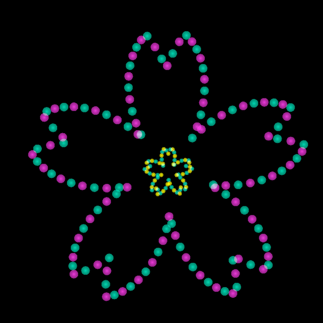
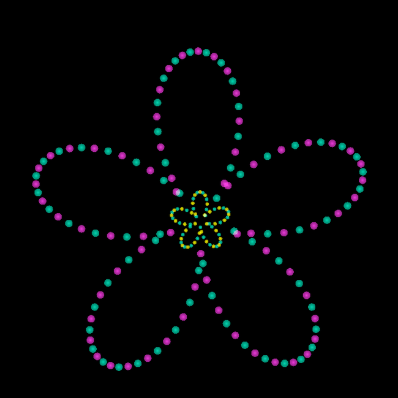
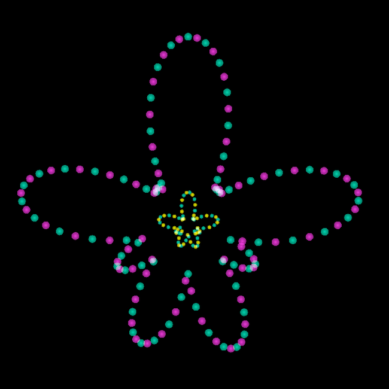
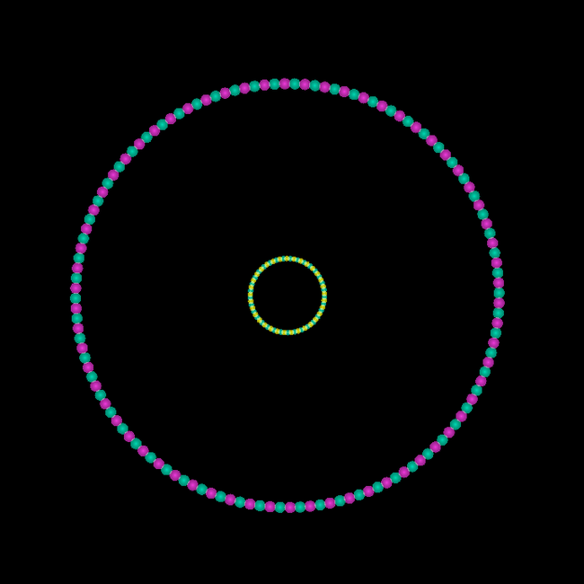
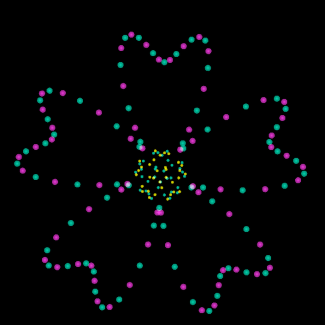
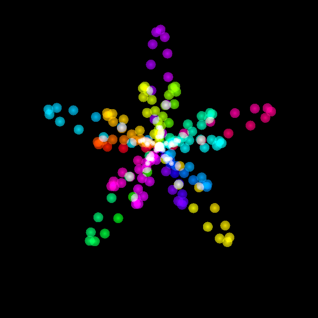
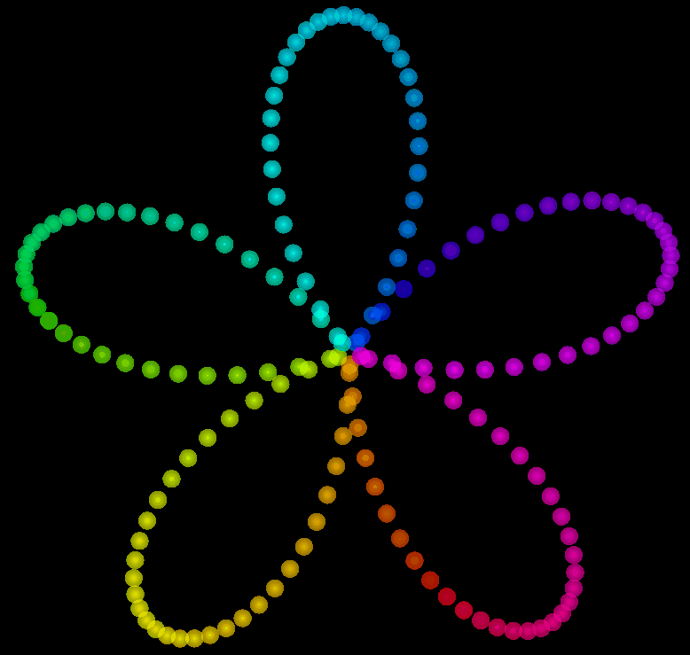
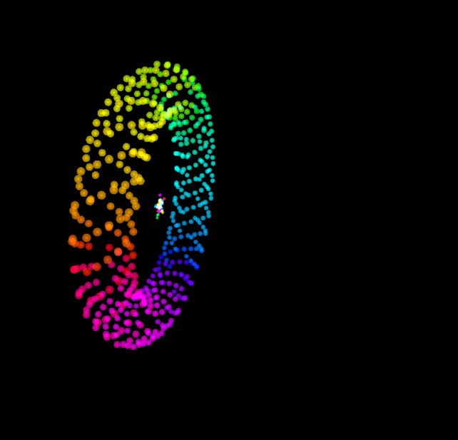
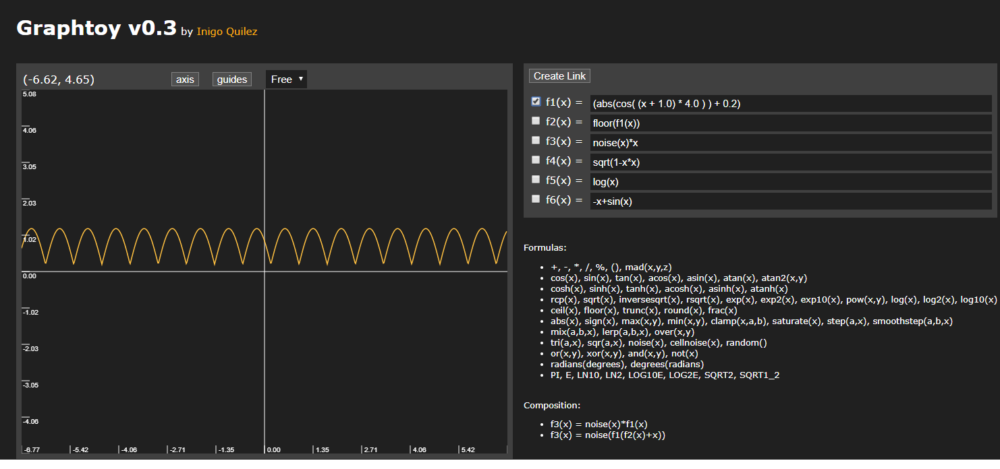

Formula Accessory
==== 
数式で定義される軌道上を移動するGPUパーティクルです。

# 動作環境
- Unity : 2017.4.28f1  
- OculusQuestでの動作確認はしていません。ご了承ください。
# Description
- 外側と内側で異なる模様を設定できます。内側の模様を非表示にすることもできます。
## 基本形
こちら側でいくつかの数式を使って形状を作れるようにしました。  
以下に、その一覧を掲示します。  

形状の名前は私が形を見てそれっぽい名前を付けただけなので人によっては捉え方が異なるかもしれません。 ご了承ください。

<details><summary>桜</summary> 
  
</details>  

<details><summary>花</summary>
  
</details>  

<details><summary>アメーバ</summary>
  
</details>

<details><summary>円</summary>  
  
</details>

<details><summary>リボン</summary>  
  
</details>

## 応用形

パラメータを少し変えると作れる形の一例をあげます。  
私が見つけただけなので設定次第ではもっと面白い形が作れるかもしれません。

<details><summary>星</summary>  
  
</details>  
<details><summary>中央でクロスする図形</summary>  
 </details>

<details><summary>螺旋構造</summary>  

</details>

# 新しく数式を登録する方法
<font color="red">**㊟最初に話しておくと新しく数式を登録するのにShader内のコードをいじらなくてはいけないためかなり面倒くさい作業になります。もっと簡単な方法もあると思うのですが実装はできなかったです。 すみません...**</font>

FomulaAccessoryで使用されている数式は基本的に極座標系での数式を使用しています。  
そのため、x軸を偏角Θ、y軸を原点からの距離rと見立てます。
以下に、花模様の数式とその数式から生成されるグラフを掲載します。また上記に記した通りxをΘ、yをrと見立ててください。  

  


1. 新しく数式を登録する場合は、まず極座標系での数式を探してください。
1. 次に1で見つけた数式の**x**を**theta**という文字列に置き換えてください。
1. 2で作成した数式をShaderのコード内に埋め込みます。<u><font color="red">例としてここではSAMPLEという名前で登録することにします。</font></u>  
FomulaAccessory.shader内の97行目あたりに記載されている以下のコードの近くに新しく数式を定義するコードを記載します。

```diff
// 模様を形成する数式のマクロ
#define FORMULA_FLOWER (abs(cos( (theta + 1.0) * _HalfPetalNum) ) + 0.2 + _ParticleCenterFactor)
+#define FORMULA_SAMPLE (xをthetaで置き換え済みの登録したい数式)
``` 
4. Shaderのマルチコンパイルを定義します。FomulaAccessory.shader内の85行目辺りと92行目辺りに記載されている以下のコードの近くに新しくマルチコンパイル用の定義をします。  

**外側の模様** 
```diff
#pragma shader_feature _OUTSIDEFORM_FLOWER
+#pragma shader_feature _OUTSIDEFORM_SAMPLE
```

**内側の模様** 
```diff
#pragma shader_feature _INSIDEFORM_FLOWER
+#pragma shader_feature _INSIDEFORM_SAMPLE
```

5. Shaderのプロパティを定義します。FomulaAccessory.shader内の9行目辺りと17行目辺りに記載されている以下のコードに追加した数式の名前を追記します。

**外側の模様** 
```diff 
-[KeywordEnum(CHERRY_BLOSSOMS, FLOWER, AMEBA, CIRCLE, RIBBON)]
+[KeywordEnum(CHERRY_BLOSSOMS, FLOWER, AMEBA, CIRCLE, RIBBON, SAMPLE)]
_OUTSIDEFORM ("Outside Form", Float) = 0
```
**内側の模様** 
```diff 
-[KeywordEnum(CHERRY_BLOSSOMS, FLOWER, AMEBA, CIRCLE, RIBBON, NONE)]
+[KeywordEnum(CHERRY_BLOSSOMS, FLOWER, AMEBA, CIRCLE, RIBBON, NONE, SAMPLE)]
_INSIDEFORM ("Inside Form", Float) = 0
```

6. これで最後です。 上記で設定したプロパティとマルチコンパイルから実際にコンパイルさせるコードを登録します。  FomulaAccessory.shader内の308行目辺りと372行目辺りに記載されている以下のコードに追加した数式の名前とマクロを記載します。

**外側の模様** 
```diff
// 原点からの距離
						
#ifdef _OUTSIDEFORM_CHERRY_BLOSSOMS
half r = FORMULA_CHERRY_BLOSSOMS;

#elif _OUTSIDEFORM_FLOWER
half r = FORMULA_FLOWER;

+#elif _OUTSIDEFORM_SAMPLE
+half r = FORMULA_SAMPLE;
```
**内側の模様**

```diff
// 原点からの距離
#ifdef _INSIDEFORM_CHERRY_BLOSSOMS
half r = FORMULA_CHERRY_BLOSSOMS;

#elif _INSIDEFORM_FLOWER
half r = FORMULA_FLOWER;

+#elif _INSIDEFORM_SAMPLE
+half r = FORMULA_SAMPLE;
```
7. お疲れさまでした。以上の記述をすることで新たに数式が定義されます。 UnityのInspector上から対象の数式の名前を選択することで定義した数式の模様を作ることができます。 上記の例だと**SAMPLE**を選択すればよいことになりますね。

# 各パラメータの説明

## Outside : 外側の模様に対するプロパティ  

- **Frequency :**  
		パーティクルの数の割合です。パーティクルの数というわけではありません。

- **Particle speed :**  
		パーティクルの流れる速さです。パーティクルを動かしたくない場合は0に設定します。  

- **Main color :**
		2色で構成されるパーティクルのうちの1色目です。  

- **Sub color :**  
		2色で構成されるパーティクルのうちの2色目です。  

- **Form :**  
		登録されている数式の形状です。デフォルトでは桜、 花、 アメーバ、 円、 リボンが登録されています。  

## Inside : 内側の模様に対するプロパティ
- **Frequency :**  
	パーティクルの数の割合です。パーティクルの数というわけではありません。

- **Particle speed :**  
	パーティクルの流れる速さです。パーティクルを動かしたくない場合は0に設定します。  

- **Main color :**
	2色で構成されるパーティクルのうちの1色目です。  

- **Sub color :**  
	2色で構成されるパーティクルのうちの2色目です。  

- **Form :**  
	登録されている数式の形状です。デフォルトでは桜、 花、 アメーバ、 円、 リボン、 NONEが登録されています。

## Hue color : レインボーカラーを使用するときに設定するプロパティ
- **Rainbow Frequency :**  
	色がどれぐらいの周期で切り替わるかのパラメータです。 1だとちょうど1周で完結します。   

- **Saturation :**  
	彩度です。0に近づくほど色が薄くなり、 1に近づくほど色が濃くなります。  

- **Value of Brightness  :**  
	明度です。 0に近づくほど暗くなり、 1に近づくほど明るくなります。 と言いたいのですが明度というよりはアルファ値のような気がします...
	
## Struct : 構造に関するプロパティ  

- **Is helix :**  
	螺旋構造をするかどうかです。これが設定されるとLayer numは3以上、 Outside->Frequencyは5以上になります。  

- **Layer num:**  
	外側の模様の層の数です。 基本は1で1枚しか表示されませんが、2以上に設定するとその分の枚数分外側の模様がxyz軸方向に適当な距離だけずれて描画します。螺旋構造を使う時以外は基本1でいい気がします。

## Formula : 数式に関するプロパティ

- **Petal num :**  
	花びらの数です。 アメーバに関しては花びらとかないのですが一応ここをいじるとアメーバの形状が少し変わるようになっています。 またこの値は外側の模様と内側の模様どちらにも適用されます。

## Advanced Settings : 設定したい人がいたら設定するプロパティ

- **Particle size :**  
	内側と外側のパーティクルのサイズです。 調節をしているので同じ大きさになることはないのですが、変更は内側と外側の両者に対して適用されます。

- **Outside size :**  
	外側の模様全体の大きさです。 基本はGameObjectのサイズを変えればいいのですが、外側のサイズだけを変えたいときに使用します。  
- **Inside size :**  
	内側の模様全体の大きさです。 基本はGameObjectのサイズを変えればいいのですが、内側のサイズだけを変えたいときに使用します。  

- **Particle center factor :**  
	内側と外側の模様の中央値から広がりです。 大きくするほど模様の中央は広くなり、小さくするほど模様の中央は狭くなります。

- **Particle clearness :**  
	パーティクルの透明度です。 大きくすると透明感が薄くなります。 

# 同梱物の説明

- **Shaders/FormulaAccessory.shader :** 
こちらを適当なMaterialにアタッチして使用します。パラメータを変更することで自由に形、色などを変更することが可能です。  

- **Scripts/ResetMesh.cs :**  
Meshの変更をShaderに伝えるScriptです。

- **Scripts/CustomShaderGUI.cs :**  
Shaderのプロパティの見た目を変更するエディタ拡張です。

- **Models/FormulaRingModel :**  
33ポリゴンのリングです。 形が少し歪かもしれませんがShaderでポリゴンを変形するのであまり気にする必要ないと思います。 
- **Materials/*.mat :**  
私があらかじめパラメータを設定したマテリアル集です。
- **Prefabs/FomulaAccessory_Mesh.prefab :**  
Meshrendererを使用したFomulaAccessoryです。アクセサリーとして使用するのであれば基本的にこちらを使用すればいいと思います。 
- **Prefabs/FomulaAccessory_Mesh.prefab :**  
SkinnedMeshRendererを使用したFomulaAccessoryです。 大きめのオブジェクトとして使用するのであればこちらを使用すると良いと思います。

# ヘルパー機能

- ## ShaderGUIについて(エディタ拡張)  
  作成したShaderには普段は設定する必要のないパラメータがあったため、それらを普段は気にすることのないようにしたいと思っていました。そこでShaderGUIを使用したエディタ拡張を実装することにしました。  
  これによって基本的なパラメータ以外は設定する意思や機会があるときだけ設定可能とすることができました。  
 
- ## Reset Meshについて  
- **使い方 :**  
Mesh FilterまたはSkinned Mesh Rendererに登録されているMeshのポリゴン数を読み取り、Shaderに伝える機能を提供します。
Meshを変更したら **Mesh Updateボタン** をクリックしてください。そうすることでポリゴン数にあった描画がされます。

- **説明 :**   
以下の説明は使用に関しては特に関与しないので読まなくても大丈夫です。  
作成したShaderはメッシュのポリゴン数に依存するためメッシュのポリゴン数をShaderに伝える必要がありました。

  ポリゴン数を直接入力する形だとポリゴン数を予め調べて入力する必要があり面倒くさいと感じたため、ScriptからGameObjectにアタッチされているメッシュのポリゴン数を調べてShaderに伝える機能を作成しました。   

  エディタ拡張でメッシュが変更されたら自動で更新する方法も調べてみたのですが、Project内の全Mesh Rendererに対して処理が行われてしまい、無駄が多くなると感じたため手動でボタンを押したときだけ更新するようにしました。


# 利用規約

- 本データの著作権は製作者PULSYに帰属します。
- 本データによって生じた損失に対して制作者は一切の責任を負いません。

## 許可していること

- 改変・解析
- 商用利用
- Virtual Marketでのブースの一部に組み込んでのアップロード(他イベント等でも単体での2次配布が目的でなければOKです。)  

## 禁止していること
- 2次配布(有償・無償に関わらず)
- 本データを使用した迷惑行為

# Author
### PULSY

### Twitter : @impreplus  

使用の際の疑問点などがあればお気軽にお問い合わせください。